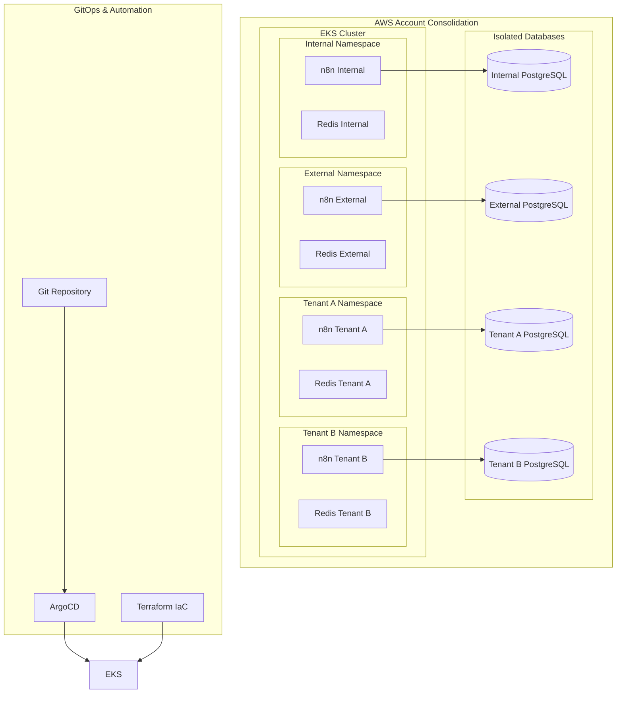
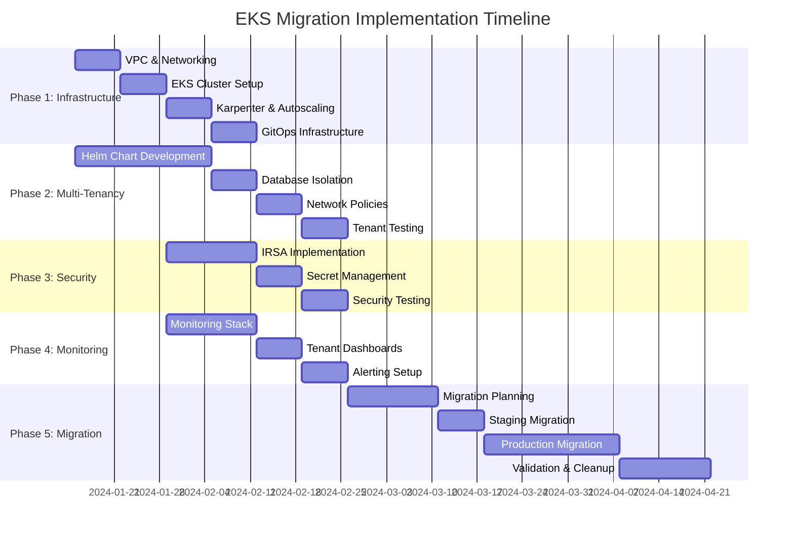

# EKS Migration Implementation Plan

## n8n Multi-Tenant Architecture with Strong Database Isolation

### Executive Summary

This document outlines a comprehensive implementation plan for migrating from the current ECS/Fargate-based n8n deployment to a modern, scalable Amazon EKS infrastructure. The migration addresses critical business requirements including multi-tenancy with strong database isolation, clear separation between internal and external instances, improved cost efficiency, and enhanced scalability.

### Background & Business Drivers

**Current State Challenges:**

- Multiple separate ECS stacks across different AWS accounts (inefficient and costly)
- Limited scalability with current ECS + Fargate setup
- No multi-tenancy support with strong database isolation
- Operational complexity managing multiple separate environments

**Business Objectives:**

1. Deploy n8n internally and externally with appropriate data access controls
2. Implement multi-tenancy with strong database isolation between tenants
3. Consolidate infrastructure for improved cost efficiency and operational simplicity
4. Achieve scalability through modern Kubernetes-based architecture

### Solution Architecture Overview

The solution leverages Amazon EKS as the foundation for a modern, scalable, multi-tenant n8n deployment with the following key architectural components:



### Key Architectural Decisions

#### ADR-001: Database Isolation Strategy

**Decision**: RDS per tenant for maximum isolation

- **Rationale**: Strongest possible tenant isolation, regulatory compliance
- **Trade-offs**: Higher cost vs security and isolation guarantees
- **Implementation**: Terraform-automated RDS provisioning per tenant

#### ADR-002: Internal vs External Separation

**Decision**: Namespace separation + Network Policies + IRSA differentiation

- **Rationale**: Balance between security and operational simplicity
- **Benefits**: Clear network isolation, granular AWS permissions, simplified operations

#### ADR-003: Tenant Onboarding Automation

**Decision**: Semi-automated GitOps with approval workflow

- **Rationale**: Balance between automation efficiency and control
- **Implementation**: ArgoCD ApplicationSets with approval gates

### Technology Stack

**Core Infrastructure:**

- **Amazon EKS**: Managed Kubernetes control plane
- **Terraform**: Infrastructure as Code for all AWS resources
- **Karpenter**: Intelligent node provisioning and auto-scaling
- **Amazon VPC**: Network isolation and security

**Application Layer:**

- **Helm**: Application packaging and templating
- **n8n**: Workflow automation engine (main + worker components)
- **PostgreSQL**: Primary database (RDS per tenant)
- **Redis**: Caching and queue management (ElastiCache per tenant)

**DevOps & Automation:**

- **ArgoCD**: GitOps continuous deployment
- **Prometheus/Grafana**: Monitoring and observability
- **AWS Load Balancer Controller**: Ingress management
- **External Secrets Operator**: Secret management

**Security:**

- **IAM Roles for Service Accounts (IRSA)**: Fine-grained AWS permissions
- **Kubernetes Network Policies**: Tenant traffic isolation
- **Pod Security Standards**: Container security baseline

### Implementation Phases

#### Phase 1: Infrastructure Foundation (Weeks 1-4)

**Objective**: Establish core EKS infrastructure with networking and security

**Key Components:**

- VPC setup with public/private subnets optimized for multi-tenant growth
- EKS cluster creation with proper logging and security configuration
- Karpenter installation for intelligent node provisioning
- Basic security groups and network ACLs

**Success Criteria:**

- EKS cluster operational and accessible via kubectl
- Karpenter successfully provisioning nodes based on workload demands
- Network foundation ready for multi-tenant isolation

#### Phase 2: Multi-Tenant Architecture (Weeks 5-8)

**Objective**: Implement comprehensive multi-tenant capabilities

**Key Components:**

- Comprehensive n8n Helm chart with all components (main, worker, PostgreSQL, Redis)
- Namespace-per-tenant strategy with RBAC implementation
- Database isolation with automated RDS provisioning
- Network policies for complete tenant traffic isolation

**Success Criteria:**

- Helm chart successfully deploys complete n8n stack
- Tenants completely isolated at network and database levels
- No cross-tenant communication possible

#### Phase 3: Security Implementation (Weeks 9-10)

**Objective**: Implement comprehensive security controls

**Key Components:**

- IRSA configuration for internal vs external n8n instances
- Differential AWS permissions (customer data access vs no access)
- Comprehensive network policy implementation
- Secret management with External Secrets Operator

**Success Criteria:**

- Internal instances cannot access customer data resources
- External instances have appropriate customer data access
- All secrets managed centrally and rotated automatically

#### Phase 4: Monitoring & Observability (Weeks 11-12)

**Objective**: Complete monitoring and operational visibility

**Key Components:**

- Prometheus/Grafana stack installation and configuration
- Tenant-specific dashboards and alerting
- Cost monitoring and optimization tooling
- Operational runbooks and procedures

**Success Criteria:**

- Complete visibility into cluster and application metrics
- Per-tenant resource usage and cost tracking
- Automated alerting for critical issues

#### Phase 5: Migration Execution (Weeks 13-18)

**Objective**: Migrate existing workloads with zero downtime

**Key Components:**

- Detailed migration plan for each existing environment
- Data migration tooling and procedures
- Rollback procedures and contingency planning
- User acceptance testing and validation

**Success Criteria:**

- All existing n8n instances migrated successfully
- Zero data loss during migration
- Improved performance and operational efficiency

### Multi-Tenancy Implementation Details

#### Tenant Isolation Strategy

**Network Isolation:**

```yaml
# Example Network Policy for Tenant Isolation
apiVersion: networking.k8s.io/v1
kind: NetworkPolicy
metadata:
  name: tenant-a-isolation
  namespace: tenant-a
spec:
  podSelector: {}
  policyTypes:
    - Ingress
    - Egress
  ingress:
    - from:
        - namespaceSelector:
            matchLabels:
              name: tenant-a
  egress:
    - to:
        - namespaceSelector:
            matchLabels:
              name: tenant-a
    - to: []
      ports:
        - protocol: TCP
          port: 443 # HTTPS egress for external APIs
```

**Database Isolation Architecture:**

- Each tenant receives dedicated RDS PostgreSQL instance
- No shared database infrastructure between tenants
- Tenant-specific backup and restore procedures
- Independent scaling and performance tuning per tenant

**Resource Isolation:**

```yaml
# Example Resource Quota per Tenant
apiVersion: v1
kind: ResourceQuota
metadata:
  name: tenant-a-quota
  namespace: tenant-a
spec:
  hard:
    requests.cpu: "4"
    requests.memory: 8Gi
    limits.cpu: "8"
    limits.memory: 16Gi
    persistentvolumeclaims: "10"
```

#### Helm Chart Architecture

**Chart Structure:**

```
n8n-tenant-chart/
├── Chart.yaml
├── values.yaml
├── templates/
│   ├── n8n-main/
│   │   ├── deployment.yaml
│   │   ├── service.yaml
│   │   └── ingress.yaml
│   ├── n8n-worker/
│   │   └── deployment.yaml
│   ├── postgresql/
│   │   ├── statefulset.yaml  # If in-cluster
│   │   └── external-secret.yaml  # If RDS
│   ├── redis/
│   │   └── deployment.yaml
│   ├── network-policies/
│   │   └── tenant-isolation.yaml
│   └── rbac/
│       ├── service-account.yaml
│       └── role-binding.yaml
└── values-examples/
    ├── tenant-a-values.yaml
    ├── tenant-b-values.yaml
    ├── internal-values.yaml
    └── external-values.yaml
```

### Cost Optimization Strategy

#### Resource Efficiency Improvements

**Current State (ECS across multiple accounts):**

- Fixed capacity allocation regardless of usage
- Separate load balancers and networking per account
- Limited resource sharing and optimization
- Manual scaling and management overhead

**Target State (Consolidated EKS):**

- Dynamic resource allocation with Karpenter
- Shared cluster infrastructure with tenant isolation
- Automatic bin-packing of workloads for optimal utilization
- Spot instance integration for non-critical workloads

#### Projected Cost Savings

**Infrastructure Consolidation:**

- 60-70% reduction in load balancer costs (shared ALB vs per-account)
- 40-50% reduction in networking costs (single VPC vs multiple)
- 30-40% reduction in compute costs through better utilization

**Operational Efficiency:**

- Reduced management overhead (single cluster vs multiple accounts)
- Automated scaling reduces over-provisioning
- Standardized deployment procedures across all tenants

### Security Architecture

#### Internal vs External Instance Separation

**Internal n8n Instances:**

- No access to customer data buckets or databases
- Limited AWS permissions for internal operational data only
- Network policies prevent access to external data sources
- Monitoring and auditing for compliance verification

**External n8n Instances:**

- Controlled access to customer data based on tenant requirements
- Comprehensive audit logging of all customer data access
- Network policies allow access to tenant-specific resources only
- Regular security assessments and compliance validation

#### IRSA (IAM Roles for Service Accounts) Implementation

```yaml
# Example IRSA configuration for Internal Instance
apiVersion: v1
kind: ServiceAccount
metadata:
  name: n8n-internal-sa
  namespace: n8n-internal
  annotations:
    eks.amazonaws.com/role-arn: arn:aws:iam::ACCOUNT:role/n8n-internal-role

---
# Example IRSA configuration for External Instance
apiVersion: v1
kind: ServiceAccount
metadata:
  name: n8n-external-sa
  namespace: n8n-external
  annotations:
    eks.amazonaws.com/role-arn: arn:aws:iam::ACCOUNT:role/n8n-external-role
```

### Scalability Implementation

#### Horizontal Pod Autoscaling (HPA)

```yaml
apiVersion: autoscaling/v2
kind: HorizontalPodAutoscaler
metadata:
  name: n8n-main-hpa
  namespace: tenant-a
spec:
  scaleTargetRef:
    apiVersion: apps/v1
    kind: Deployment
    name: n8n-main
  minReplicas: 2
  maxReplicas: 10
  metrics:
    - type: Resource
      resource:
        name: cpu
        target:
          type: Utilization
          averageUtilization: 70
    - type: Resource
      resource:
        name: memory
        target:
          type: Utilization
          averageUtilization: 80
```

#### Karpenter Node Provisioning

```yaml
apiVersion: karpenter.sh/v1alpha5
kind: Provisioner
metadata:
  name: n8n-provisioner
spec:
  requirements:
    - key: karpenter.sh/capacity-type
      operator: In
      values: ["spot", "on-demand"]
    - key: kubernetes.io/arch
      operator: In
      values: ["amd64"]
  limits:
    resources:
      cpu: 1000
      memory: 1000Gi
  providerRef:
    name: n8n-nodepool
  ttlSecondsAfterEmpty: 30
```

### Migration Strategy

#### Migration Approach: Blue-Green with Gradual Cutover

**Phase 1: Preparation**

- Set up complete EKS environment with all components
- Validate functionality with test data and synthetic workloads
- Establish monitoring and alerting for new environment

**Phase 2: Parallel Operation**

- Run both ECS and EKS environments in parallel
- Migrate test and development workloads first
- Validate data synchronization and application behavior

**Phase 3: Production Migration**

- Migrate production workloads during low-traffic periods
- Use DNS and load balancer cutover for zero-downtime migration
- Maintain ECS environment as fallback until stability confirmed

**Phase 4: Cleanup**

- Decommission ECS resources after successful migration validation
- Update documentation and operational procedures
- Conduct post-migration performance and cost analysis

#### Data Migration Considerations

**Database Migration:**

- Use AWS DMS for PostgreSQL data migration with minimal downtime
- Implement data validation and integrity checks
- Plan for rollback procedures in case of migration issues

**Configuration Migration:**

- Export existing n8n workflows and configurations
- Validate compatibility with new environment
- Implement automated configuration deployment via GitOps

### Risk Management

#### High-Risk Areas and Mitigations

**Database Isolation Complexity (Critical Risk)**

- _Mitigation_: Start with RDS-per-tenant approach for maximum isolation
- _Testing_: Comprehensive tenant isolation testing and security validation
- _Fallback_: Schema-based isolation as backup approach

**Network Policy Misconfiguration (High Risk)**

- _Mitigation_: Comprehensive testing environment with network validation tools
- _Testing_: Automated network policy testing in CI/CD pipeline
- _Monitoring_: Continuous network traffic monitoring and alerting

**Migration Downtime (High Risk)**

- _Mitigation_: Blue-green deployment with DNS cutover strategy
- _Testing_: Full migration rehearsals in staging environment
- _Rollback_: Automated rollback procedures with clear decision criteria

#### Medium Risk Areas

**Cost Overrun with RDS per Tenant**

- _Monitoring_: Real-time cost monitoring and alerting
- _Optimization_: Reserved instance planning and rightsizing automation
- _Alternative_: Schema-based isolation if costs exceed budgets

**Karpenter Learning Curve**

- _Mitigation_: Start with simple configurations and gradual complexity increase
- _Training_: Team training and documentation development
- _Support_: Establish support channels with AWS and community

### Success Metrics

#### Technical Success Criteria

**Performance Metrics:**

- Application response time: <200ms for 95th percentile
- Database query performance: No degradation from current state
- Auto-scaling effectiveness: Target utilization maintained within 5%

**Reliability Metrics:**

- System uptime: >99.9% availability
- Zero security incidents related to tenant isolation
- Successful recovery testing: <30 minutes RTO

**Cost Efficiency Metrics:**

- 30-40% reduction in overall infrastructure costs
- Resource utilization improvement: >70% average CPU/memory utilization
- Operational overhead reduction: 50% reduction in management time

#### Business Success Criteria

**Operational Efficiency:**

- Tenant onboarding time: <4 hours for new tenant provisioning
- Deployment frequency: Support for daily deployments
- Incident response time: <15 minutes for critical issues

**Scalability Achievement:**

- Support for 10x current tenant load without architectural changes
- Automatic scaling handles 5x traffic spikes without manual intervention
- New tenant onboarding without cluster modifications

### Implementation Timeline



### Next Steps

#### Immediate Actions (Week 1)

1. **Architectural Decision Approval**

   - Finalize database isolation strategy (RDS per tenant)
   - Approve internal/external separation approach
   - Confirm tenant onboarding workflow design

2. **Team Preparation**

   - Allocate infrastructure and development resources
   - Schedule architecture and security reviews
   - Establish project communication channels

3. **Technology Validation**
   - Set up proof-of-concept EKS cluster
   - Validate Helm chart approach with sample deployment
   - Test Karpenter node provisioning

#### Week 2-4 Priorities

1. **Infrastructure Development**

   - Begin Terraform module development for EKS
   - Implement VPC and networking configuration
   - Set up GitOps repository structure

2. **Security Design**

   - Finalize IRSA role definitions
   - Design network policy templates
   - Plan secret management integration

3. **Application Architecture**
   - Complete n8n Helm chart development
   - Design tenant values.yaml templates
   - Plan database provisioning automation

### Conclusion

This EKS migration plan provides a comprehensive roadmap for transitioning from the current ECS-based infrastructure to a modern, scalable, multi-tenant Kubernetes environment. The approach balances strong security isolation requirements with cost efficiency and operational simplicity.

The phased implementation approach minimizes risk while ensuring business continuity throughout the migration process. The resulting architecture will provide the foundation for future growth and innovation while addressing current limitations in scalability and multi-tenancy support.

Success depends on careful execution of the architectural decisions, thorough testing at each phase, and maintaining focus on the core business objectives of security, efficiency, and scalability.
