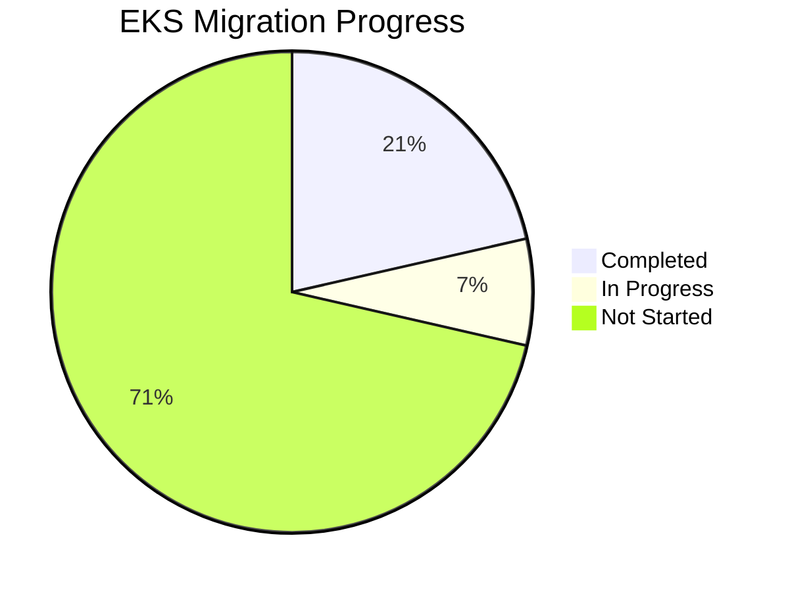
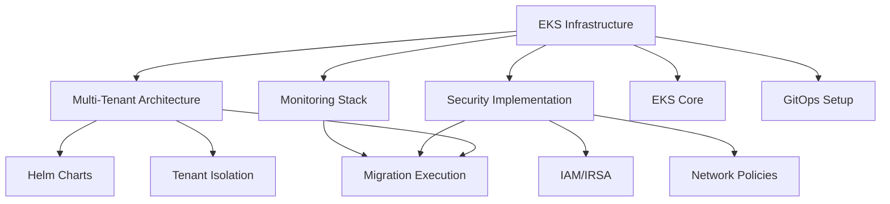
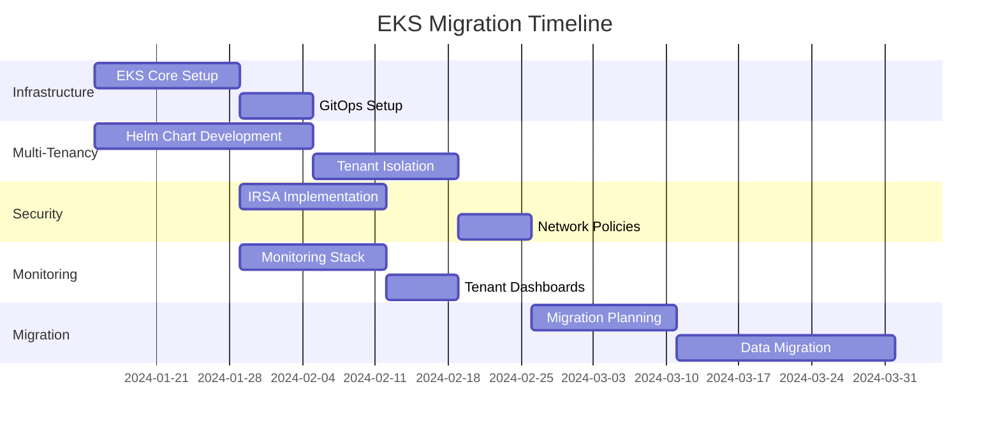

# TASKS - K8S n8n NABI

> **📌 SINGLE SOURCE OF TRUTH**  
> This file serves as the central task tracking system for the Memory Bank.  
> All task status, progress, and coordination flows through this document.

## 🎯 CURRENT ACTIVE TASK

**Task ID**: EKS-MIGRATION-001  
**Title**: n8n Multi-Tenant EKS Migration with Strong DB Isolation  
**Mode**: PLAN → IMPLEMENT  
**Priority**: CRITICAL  
**Status**: PLANNING  
**Complexity Level**: Level 4 - Complex System  
**Assigned**: System Architecture Team

### Task Description

Complete migration from ECS/Fargate to Amazon EKS for n8n deployment with multi-tenancy support, strong database isolation, and improved scalability. This involves transitioning from multiple separate ECS stacks across different AWS accounts to a consolidated, cost-effective EKS infrastructure that supports both internal and external n8n instances with robust tenant isolation.

### Success Criteria

- [ ] Comprehensive EKS migration plan created with architectural diagrams
- [ ] Multi-tenancy implementation with strong DB isolation per tenant
- [ ] Clear separation between internal and external n8n instances
- [ ] Improved resource utilization and cost-effectiveness
- [ ] Scalability implementation with HPA and Karpenter
- [ ] GitOps-based deployment pipeline established
- [ ] Security implementation with IRSA and network policies
- [ ] Comprehensive testing and validation completed
- [ ] Production deployment plan approved and executed

### Technology Stack Validation

- **Container Platform**: Amazon EKS (Managed Kubernetes)
- **Infrastructure as Code**: Terraform + Helm
- **GitOps**: ArgoCD or FluxCD
- **Automation Engine**: n8n workflow platform
- **Database**: PostgreSQL (RDS per tenant for strong isolation)
- **Cache/Queue**: Redis (ElastiCache per tenant)
- **Autoscaling**: Horizontal Pod Autoscaler (HPA) + Karpenter
- **Monitoring**: Prometheus/Grafana or commercial solution
- **Security**: AWS IAM Roles for Service Accounts (IRSA)

### Technology Validation Checkpoints

- [ ] EKS cluster initialization and basic connectivity verified
- [ ] Terraform EKS module configuration validated
- [ ] Helm chart for n8n stack tested with sample deployment
- [ ] ArgoCD/FluxCD GitOps workflow established
- [ ] Karpenter node provisioning tested
- [ ] Network policies tested for tenant isolation
- [ ] IRSA permissions tested for internal vs external separation
- [ ] Multi-tenant database isolation pattern validated

## 📋 EKS MIGRATION SYSTEM BREAKDOWN

### EKS-INFRA: Infrastructure Foundation

**Status**: IN PROGRESS
**Progress**: 60%
**Dependencies**: None  
**Responsible**: Infrastructure Team

#### EKS-INFRA-CORE: Core EKS Infrastructure

- **Description**: Establish foundational EKS cluster with VPC, networking, and security
- **Status**: COMPLETE ✅
- **Priority**: CRITICAL
- **Related Requirements**: Cost optimization, scalability, security isolation
- **Quality Criteria**: Cluster operational, security hardened, cost-optimized node groups

**Tasks**:

- [x] EKS-TASK-001: VPC and Networking Setup

  - **Description**: Create VPC with public/private subnets, NAT gateways, security groups
  - **Status**: COMPLETE ✅
  - **Estimated Effort**: 3 days
  - **Dependencies**: None
  - **Risk Assessment**: Low - standard AWS networking patterns
  - **Quality Gates**: Network connectivity, security group rules validated

  **Subtasks**:

  - [x] Create VPC with CIDR planning for multi-tenant growth
  - [x] Set up public subnets for load balancers
  - [x] Configure private subnets for EKS nodes
  - [x] Create NAT gateways for outbound internet access
  - [x] Configure security groups for EKS cluster

- [x] EKS-TASK-002: EKS Cluster Creation

  - **Description**: Create managed EKS cluster with proper IAM roles and logging
  - **Status**: COMPLETE ✅
  - **Estimated Effort**: 2 days
  - **Dependencies**: EKS-TASK-001
  - **Risk Assessment**: Medium - requires proper IAM configuration
  - **Quality Gates**: Cluster accessible, logging enabled, kubectl connectivity

  **Subtasks**:

  - [x] Create EKS cluster IAM role
  - [x] Configure EKS cluster with appropriate version
  - [x] Enable EKS cluster logging
  - [x] Configure cluster endpoint access
  - [x] Set up cluster security groups

- [x] EKS-TASK-003: Karpenter Installation

  - **Description**: Install and configure Karpenter for intelligent node provisioning
  - **Status**: COMPLETE ✅
  - **Estimated Effort**: 2 days
  - **Dependencies**: EKS-TASK-002
  - **Risk Assessment**: Medium - new technology, requires proper IAM
  - **Quality Gates**: Karpenter pods running, can provision nodes automatically

  **Subtasks**:

  - [x] Create Karpenter IAM roles and policies
  - [x] Install Karpenter using Helm chart
  - [x] Configure Karpenter provisioners for different workload types
  - [x] Test automatic node provisioning
  - [x] Configure Spot instance support

#### EKS-INFRA-GITOPS: GitOps Infrastructure

- **Description**: Implement GitOps workflow for automated deployments
- **Status**: PLANNING
- **Priority**: HIGH
- **Dependencies**: EKS-INFRA-CORE
- **Quality Criteria**: GitOps operational, automated deployments working

**Tasks**:

- [ ] EKS-TASK-004: ArgoCD Installation

  - **Description**: Install and configure ArgoCD for GitOps deployments
  - **Status**: TODO
  - **Estimated Effort**: 2 days
  - **Dependencies**: EKS-TASK-002
  - **Risk Assessment**: Low - mature GitOps tool
  - **Quality Gates**: ArgoCD UI accessible, can sync from Git repos

- [ ] EKS-TASK-005: Git Repository Structure
  - **Description**: Create Git repository structure for GitOps workflow
  - **Status**: TODO
  - **Estimated Effort**: 1 day
  - **Dependencies**: None (can be parallel)
  - **Risk Assessment**: Low - organizational task
  - **Quality Gates**: Repository structure follows GitOps best practices

### EKS-TENANT: Multi-Tenant Architecture

**Status**: PLANNING  
**Progress**: 0%  
**Dependencies**: EKS-INFRA-CORE  
**Responsible**: Application Architecture Team

#### EKS-TENANT-HELM: Helm Chart Development

- **Description**: Create comprehensive Helm chart for n8n tenant stack
- **Status**: PLANNING
- **Priority**: CRITICAL
- **Quality Criteria**: Helm chart deploys complete n8n stack with tenant isolation

**Tasks**:

- [ ] EKS-TASK-006: n8n Helm Chart Creation

  - **Description**: Create Helm chart for complete n8n stack (main, worker, postgres, redis)
  - **Status**: TODO
  - **Estimated Effort**: 5 days
  - **Dependencies**: None (can be parallel)
  - **Risk Assessment**: Medium - complex multi-component chart
  - **Quality Gates**: Chart deploys successfully, all components healthy

  **Subtasks**:

  - [ ] Create n8n main deployment template
  - [ ] Create n8n worker deployment template
  - [ ] Create PostgreSQL StatefulSet template
  - [ ] Create Redis deployment template
  - [ ] Create service and ingress templates
  - [ ] Configure persistent volume templates
  - [ ] Add ConfigMap and Secret templates
  - [ ] Create values.yaml with tenant-specific configurations

- [ ] EKS-TASK-007: Database Isolation Strategy

  - **Description**: Implement strong database isolation between tenants
  - **Status**: TODO
  - **Estimated Effort**: 3 days
  - **Dependencies**: EKS-TASK-006
  - **Risk Assessment**: High - critical for tenant security
  - **Quality Gates**: Each tenant has isolated database, no cross-tenant access

  **Subtasks**:

  - [ ] Design per-tenant RDS instance provisioning
  - [ ] Configure Terraform for automated RDS creation
  - [ ] Implement tenant-specific database credentials management
  - [ ] Test database isolation between tenants
  - [ ] Create database backup and restore procedures

#### EKS-TENANT-ISOLATION: Network and Resource Isolation

- **Description**: Implement robust isolation between tenants and internal/external instances
- **Status**: PLANNING
- **Priority**: CRITICAL
- **Quality Criteria**: Complete network isolation, no cross-tenant communication

**Tasks**:

- [ ] EKS-TASK-008: Namespace Strategy

  - **Description**: Implement namespace-per-tenant strategy with appropriate policies
  - **Status**: TODO
  - **Estimated Effort**: 2 days
  - **Dependencies**: EKS-TASK-006
  - **Risk Assessment**: Medium - requires careful RBAC configuration
  - **Quality Gates**: Tenants isolated in separate namespaces, appropriate RBAC

- [ ] EKS-TASK-009: Network Policies

  - **Description**: Create comprehensive network policies for tenant isolation
  - **Status**: TODO
  - **Estimated Effort**: 3 days
  - **Dependencies**: EKS-TASK-008
  - **Risk Assessment**: High - critical for security
  - **Quality Gates**: Network traffic properly restricted between tenants

  **Subtasks**:

  - [ ] Design network policy templates
  - [ ] Implement default deny policies
  - [ ] Create tenant-specific allow policies
  - [ ] Test network isolation between tenants
  - [ ] Validate internal vs external isolation

### EKS-SECURITY: Security Implementation

**Status**: PLANNING  
**Progress**: 0%  
**Dependencies**: EKS-INFRA-CORE  
**Responsible**: Security Team

#### EKS-SECURITY-IRSA: IAM Roles for Service Accounts

- **Description**: Implement fine-grained AWS permissions using IRSA
- **Status**: PLANNING
- **Priority**: CRITICAL
- **Quality Criteria**: Proper AWS resource access control per tenant type

**Tasks**:

- [ ] EKS-TASK-010: IRSA Configuration

  - **Description**: Configure IAM roles for different n8n instance types
  - **Status**: TODO
  - **Estimated Effort**: 3 days
  - **Dependencies**: EKS-TASK-002
  - **Risk Assessment**: High - critical for security model
  - **Quality Gates**: Different permissions for internal vs external instances

  **Subtasks**:

  - [ ] Create IAM roles for internal n8n instances (no customer data access)
  - [ ] Create IAM roles for external n8n instances (customer data access)
  - [ ] Configure OIDC provider for EKS cluster
  - [ ] Implement service account annotations
  - [ ] Test permission boundaries

### EKS-MONITORING: Observability and Monitoring

**Status**: PLANNING  
**Progress**: 0%  
**Dependencies**: EKS-INFRA-CORE  
**Responsible**: DevOps Team

#### EKS-MONITORING-STACK: Monitoring Infrastructure

- **Description**: Implement comprehensive monitoring for multi-tenant EKS environment
- **Status**: PLANNING
- **Priority**: HIGH
- **Quality Criteria**: Full visibility into cluster and application metrics

**Tasks**:

- [ ] EKS-TASK-011: Prometheus Stack Installation

  - **Description**: Install Prometheus, Grafana, and AlertManager
  - **Status**: TODO
  - **Estimated Effort**: 2 days
  - **Dependencies**: EKS-TASK-002
  - **Risk Assessment**: Low - well-established monitoring stack
  - **Quality Gates**: Metrics collection working, dashboards accessible

- [ ] EKS-TASK-012: Tenant-Specific Monitoring
  - **Description**: Create tenant-specific monitoring dashboards and alerts
  - **Status**: TODO
  - **Estimated Effort**: 3 days
  - **Dependencies**: EKS-TASK-011
  - **Risk Assessment**: Medium - requires custom dashboard development
  - **Quality Gates**: Per-tenant metrics isolation and visibility

### EKS-MIGRATION: Data and Service Migration

**Status**: PLANNING  
**Progress**: 0%  
**Dependencies**: EKS-TENANT-HELM, EKS-SECURITY-IRSA  
**Responsible**: Migration Team

#### EKS-MIGRATION-PLAN: Migration Strategy

- **Description**: Plan and execute migration from ECS to EKS
- **Status**: PLANNING
- **Priority**: HIGH
- **Quality Criteria**: Zero-downtime migration, data integrity maintained

**Tasks**:

- [ ] EKS-TASK-013: Migration Planning

  - **Description**: Create detailed migration plan for each existing environment
  - **Status**: TODO
  - **Estimated Effort**: 3 days
  - **Dependencies**: All previous components
  - **Risk Assessment**: High - business continuity critical
  - **Quality Gates**: Migration plan approved by stakeholders

- [ ] EKS-TASK-014: Data Migration
  - **Description**: Migrate existing n8n data to new tenant-isolated structure
  - **Status**: TODO
  - **Estimated Effort**: 5 days
  - **Dependencies**: EKS-TASK-013
  - **Risk Assessment**: Critical - data loss prevention essential
  - **Quality Gates**: All data migrated successfully, integrity verified

## 📋 SYSTEM MILESTONES

| Milestone ID | Description                        | Target Date | Status      | Dependencies                |
| ------------ | ---------------------------------- | ----------- | ----------- | --------------------------- |
| MILE-EKS-01  | EKS Infrastructure Ready           | Week 4      | Not Started | EKS-INFRA-CORE complete     |
| MILE-EKS-02  | Multi-Tenant Architecture Complete | Week 8      | Not Started | EKS-TENANT complete         |
| MILE-EKS-03  | Security Implementation Complete   | Week 10     | Not Started | EKS-SECURITY complete       |
| MILE-EKS-04  | Monitoring and Observability Ready | Week 12     | Not Started | EKS-MONITORING complete     |
| MILE-EKS-05  | Migration Plan Approved            | Week 14     | Not Started | EKS-MIGRATION-PLAN complete |
| MILE-EKS-06  | Production Migration Complete      | Week 18     | Not Started | All components complete     |

## 📋 RISK REGISTER

| Risk ID     | Description                       | Probability | Impact   | Mitigation                                             |
| ----------- | --------------------------------- | ----------- | -------- | ------------------------------------------------------ |
| RISK-EKS-01 | Database isolation complexity     | High        | Critical | Start with RDS-per-tenant approach, test thoroughly    |
| RISK-EKS-02 | Network policies misconfiguration | Medium      | High     | Implement comprehensive testing, security review       |
| RISK-EKS-03 | Migration downtime                | Medium      | High     | Plan for phased migration, rollback procedures         |
| RISK-EKS-04 | Cost overrun with RDS per tenant  | High        | Medium   | Monitor costs closely, consider schema-based isolation |
| RISK-EKS-05 | Karpenter learning curve          | Medium      | Medium   | Start with simple configuration, gradual complexity    |
| RISK-EKS-06 | GitOps workflow complexity        | Low         | Medium   | Use proven patterns, extensive testing                 |

## 📋 PROGRESS VISUALIZATION

### Overall EKS Migration Progress



### Component Dependencies



### Timeline



## 📋 ARCHITECTURAL DECISIONS REQUIRED

### ADR-EKS-001: Database Isolation Strategy

**Status**: Needs Decision  
**Options**:

1. RDS per tenant (strongest isolation, higher cost)
2. Shared RDS with separate schemas (medium isolation, lower cost)
3. Database per tenant within shared RDS cluster (balanced approach)

**Recommendation**: Start with RDS per tenant for strongest isolation, evaluate cost impact

### ADR-EKS-002: Internal vs External Separation

**Status**: Needs Decision  
**Options**:

1. Separate EKS clusters (strongest separation, higher complexity)
2. Separate namespaces with network policies (balanced approach)
3. Same namespace with IRSA differentiation (lowest separation)

**Recommendation**: Separate namespaces with strict network policies and IRSA differentiation

### ADR-EKS-003: Tenant Onboarding Automation

**Status**: Needs Decision  
**Options**:

1. Fully automated via GitOps (highest efficiency)
2. Semi-automated with manual approval (balanced)
3. Manual tenant creation (highest control)

**Recommendation**: Semi-automated with GitOps templates and approval workflow

## 📋 CREATIVE PHASES REQUIRED

- [ ] **Database Isolation Architecture Design**: Complex decision on isolation strategy
- [ ] **Network Policy Design**: Custom network segmentation for multi-tenancy
- [ ] **Tenant Onboarding Workflow**: User experience and automation design
- [ ] **Cost Optimization Strategy**: Balance between isolation and cost efficiency
- [ ] **Migration Strategy Design**: Zero-downtime migration approach

## 📋 CURRENT STATUS SUMMARY

**Overall Progress**: 0% (Planning Phase)

- **Infrastructure Foundation**: 0% - Architecture planning in progress
- **Multi-Tenant Architecture**: 0% - Design decisions pending
- **Security Implementation**: 0% - Awaiting infrastructure foundation
- **Monitoring Setup**: 0% - Awaiting infrastructure foundation
- **Migration Execution**: 0% - Awaiting all prerequisites

**Immediate Next Steps**:

1. Complete architectural decision records (ADRs)
2. Begin EKS infrastructure Terraform development
3. Start Helm chart development in parallel
4. Validate technology choices with proof-of-concept

**Blockers**:

- Need architectural decisions on database isolation strategy
- Need approval on cost implications of multi-tenant approach
- Need resource allocation for infrastructure team

**Task ID**: READY-FOR-NEXT-PHASE  
**Title**: VAN Mode Complete - Ready for Implementation  
**Mode**: VAN → READY  
**Priority**: HIGH  
**Status**: COMPLETE ✅  
**Assigned**: Memory Bank System

**Task ID**: REMOVE-MCP-001  
**Title**: Remove MCP Server Implementation from Project  
**Mode**: PLAN → IMPLEMENT  
**Priority**: HIGH  
**Status**: PLANNING  
**Assigned**: System Architecture Team

### Task Description

Complete removal of Model Context Protocol (MCP) server implementation from the k8s-n8n-nabi project. This involves analyzing all MCP-related components, dependencies, configurations, and creating a comprehensive removal plan to ensure no breaking changes or orphaned resources.

### Success Criteria

- [x] Comprehensive analysis of MCP components completed
- [ ] Detailed removal plan created with step-by-step instructions
- [ ] All MCP-related files and directories identified
- [ ] Docker and Kubernetes configurations updated
- [ ] Dependencies cleaned up from package.json files
- [ ] Testing infrastructure updated
- [ ] Documentation updated to reflect removal
- [ ] Verification that project functions without MCP components

### Current Progress - ANALYSIS PHASE ✅

- [x] Identified MCP server directory: `mcp-server/` (complete implementation)
- [x] Found Docker configuration in `docker-compose.yml`
- [x] Located Kubernetes manifest: `k8s/base/mcp-server.yaml`
- [x] Identified test files: `test-mcp-server.js`, `test-sse-client.js`
- [x] Found dependencies: `fastmcp`, `mcp-proxy` in package.json files
- [x] Located deployment script references in `rebuild-and-deploy.sh`
- [x] Identified documentation references across README.md and docs/
- [x] Found Memory Bank references in project context files

### Completed Task: VAN-INIT-001 ✅

**VAN Mode Initialization & Memory Bank Creation** - SUCCESSFULLY COMPLETED

### Success Criteria - ALL ACHIEVED ✅

- [x] Memory Bank structure created and populated
- [x] Platform detection completed successfully (macOS ARM64, Docker, Node.js)
- [x] Essential file verification passed (all project files validated)
- [x] Project complexity level determined (Level 1 - Direct implementation ready)
- [x] Clear path to next development mode established (IMPLEMENT mode ready)

### Final Progress Summary

- [x] VAN mode activation confirmed
- [x] Memory Bank foundation files created:
  - [x] projectbrief.md
  - [x] productContext.md
  - [x] systemPatterns.md
  - [x] techContext.md
  - [x] activeContext.md
  - [x] tasks.md (this file)
  - [x] progress.md
- [x] Platform detection checkpoint ✅ (macOS, Docker 28.0.4, Node.js 20.19.0)
- [x] Basic file verification checkpoint ✅ (All files validated)
- [x] Complexity determination checkpoint ✅ (Level 1 confirmed)
- [x] Mode transition decision ✅ (Ready for IMPLEMENT or VAN QA)

## 📋 TASK QUEUE

### Recently Completed Tasks ✅

1. **VAN-VERIFY-001**: Basic File Verification

   - **Status**: COMPLETE ✅
   - **Priority**: HIGH
   - **Description**: Verified essential project files and configuration integrity
   - **Result**: All files validated successfully

2. **VAN-PLATFORM-001**: Platform Detection Process

   - **Status**: COMPLETE ✅
   - **Priority**: HIGH
   - **Description**: Completed platform detection and tool verification
   - **Result**: macOS ARM64, Docker 28.0.4, Node.js 20.19.0 ready

3. **VAN-COMPLEX-001**: Complexity Assessment
   - **Status**: COMPLETE ✅
   - **Priority**: HIGH
   - **Description**: Analyzed project requirements and determined complexity level
   - **Result**: Level 1 task - Direct implementation ready

### Next Available Actions

4. **IMPLEMENT-START**: Begin Implementation Phase

   - **Status**: READY
   - **Priority**: HIGH
   - **Description**: Start implementation tasks based on user requirements
   - **Dependencies**: VAN initialization (COMPLETE)

5. **VAN-QA-START**: Technical Validation
   - **Status**: READY
   - **Priority**: OPTIONAL
   - **Description**: Run comprehensive technical validation before implementation
   - **Dependencies**: VAN initialization (COMPLETE)

### Backlog Tasks

4. **ANALYZE-DEPS-001**: Dependency Analysis

   - **Status**: BACKLOG
   - **Priority**: MEDIUM
   - **Description**: Examine package.json and analyze project dependencies
   - **Dependencies**: File verification (PENDING)

5. **CONFIG-REVIEW-001**: Configuration Review

   - **Status**: BACKLOG
   - **Priority**: MEDIUM
   - **Description**: Review Docker Compose and Kubernetes manifests
   - **Dependencies**: File verification (PENDING)

6. **TEST-ANALYSIS-001**: Test Infrastructure Analysis
   - **Status**: BACKLOG
   - **Priority**: MEDIUM
   - **Description**: Understand current test implementation and coverage
   - **Dependencies**: File verification (PENDING)

## 🔄 WORKFLOW TRACKING

### Current Workflow State

```
VAN (Initialization) ✅ → READY FOR NEXT PHASE
├── ✅ Memory Bank Creation
├── ✅ File Verification
├── ✅ Platform Detection
├── ✅ Complexity Assessment (Level 1)
└── ✅ Mode Transition Ready (IMPLEMENT or VAN QA)
```

### Next Mode Predictions

Based on initial analysis:

- **If Level 1 Task**: Continue in VAN → Direct to IMPLEMENT
- **If Level 2-4 Task**: Force transition to PLAN mode
- **QA Override**: VAN QA mode can be triggered at any time

## 📊 PROGRESS METRICS

### Overall Project Status

- **Memory Bank**: 100% Complete ✅
- **VAN Initialization**: 100% Complete ✅
- **File Verification**: 100% Complete ✅
- **Platform Detection**: 100% Complete ✅
- **Complexity Assessment**: 100% Complete ✅ (Level 1)

### Task Completion Stats

- **Completed**: 4 tasks (Memory Bank, verification, platform, complexity)
- **Ready for Next Phase**: 2 options (IMPLEMENT, VAN QA)
- **In Progress**: 0 tasks
- **Backlog**: 3 tasks (optional analysis tasks)

## 🚨 CRITICAL PATH ANALYSIS

### Dependencies Chain

```
Memory Bank ✅ → File Verification ✅ → Platform Detection ✅ → Complexity Assessment ✅ → Mode Decision ✅
```

**🎯 CRITICAL PATH COMPLETE** - Ready for implementation phase

### Potential Blockers

- **None identified**: All prerequisites are available
- **Low Risk**: Well-structured project with existing configurations
- **Environment Ready**: macOS development environment confirmed

### Risk Mitigation

- **Parallel Processing**: Some verification tasks can run simultaneously
- **Fallback Plans**: Alternative modes available based on complexity
- **Tool Availability**: Standard development tools expected to be available

## 🎯 SESSION OBJECTIVES

### Current Session Goals

1. Complete VAN mode initialization process
2. Establish solid Memory Bank foundation
3. Determine appropriate next development mode
4. Clear any immediate blockers or issues

### Success Metrics for Session - ALL ACHIEVED ✅

- [x] VAN initialization checkpoint passed
- [x] All essential files verified as accessible
- [x] Platform confirmed as suitable for development
- [x] Clear direction for next development phase (IMPLEMENT or VAN QA ready)

## 📅 TIMING & SCHEDULING

### Completed Session Timeline

- **Start Time**: VAN mode activation
- **Memory Bank Creation**: ~15 minutes ✅
- **File Verification**: ~5 minutes ✅
- **Platform Detection**: ~5 minutes ✅
- **Complexity Assessment**: ~5 minutes ✅
- **Total VAN Time**: ~30 minutes ✅ COMPLETE

### Next Session Planning

- **Immediate Follow-up**: Based on complexity assessment results
- **If Level 1**: Continue with implementation tasks
- **If Level 2-4**: Transition to PLAN mode for proper planning
- **QA Integration**: Available at any transition point

## 🔗 INTEGRATION POINTS

### Memory Bank Synchronization

- **activeContext.md**: Updated with each major checkpoint
- **progress.md**: Will be created after VAN completion
- **systemPatterns.md**: May be updated based on discoveries
- **techContext.md**: Will be refined with actual tool verification

### Cross-Mode Coordination

- **VAN → PLAN**: For complex tasks requiring detailed planning
- **VAN → IMPLEMENT**: For simple Level 1 tasks
- **Any → QA**: QA validation can interrupt any process flow

## 📈 OPTIMIZATION OPPORTUNITIES

### Process Improvements

- **Batch File Operations**: Verify multiple files simultaneously
- **Parallel Detection**: Run platform and dependency checks together
- **Template Reuse**: Memory Bank structure can be templated for future projects

### Tool Integration

- **Automated Verification**: Scripts could automate file and platform checking
- **Status Dashboards**: Visual progress tracking for complex workflows
- **Integration Testing**: Automated validation of project setup

## 📅 LAST UPDATED

**Date**: $(Get-Date -Format "yyyy-MM-dd HH:mm:ss")  
**Context**: VAN mode initialization - Memory Bank and task tracking established  
**Next Update**: After file verification checkpoint completion  
**Update Trigger**: Completion of any major checkpoint or mode transition

## ✅ PREVIOUSLY COMPLETED TASK

**Task ID**: VAN-INIT-001 ✅  
**Title**: VAN Mode Initialization & Memory Bank Creation  
**Status**: COMPLETE

[end of memory-bank/tasks.md]
